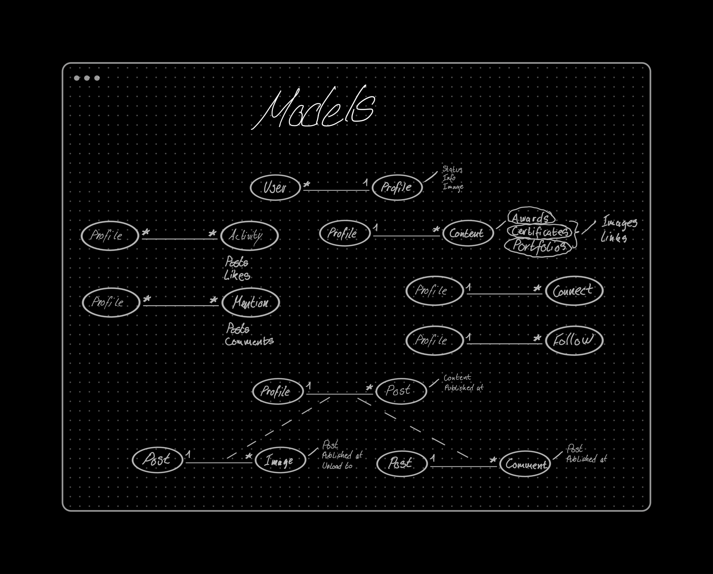

# Cotal drf API

 

## Table of Contents

- [Planes](#planes)
  - [The Surface](#surface)
  - [Skeleton](#skeleton)
  - [Structure](#structure)
  - [Scope](#scope)
  - [Strategy](#strategy)
- [Development](#development)
  - [HTML](#dev-html)
  - [CSS](#dev-css)
  - [Python](#dev-python)
  - [Testings](#testings)
  - [Bugs](#bugs)
- [Validator](#validator)
- [Deployment](#deployment)
  - [Fork](#fork)
  - [Clone](#clone)
  - [Deploy](#deploy)
- [Credits](#credits)

 

## Planes

 

### Surface

What will the product actually look like, what colors, what typography, what images/design elements, what animation, what transitions, how will the final product look like?

 

### Skeleton

(How the infomation implemented), (how will the user navigate), (how the content relate to each other, low, mid top priority, how and where to position content)?

 

### Structure

How is the information, logically grouped, the feature the elements the data?

The data model built for this project laid the foundation for how the app should work and from this point forward, all that is needed, is to get hacking.

 

### Scope

What features,(nvp), both ability and desires?

#### Minimum viable product

#### Desired features

 

### Strategy

Aiming to achieve and for whom?

 

## Development

#### Languages Used

- [Python](https://en.wikipedia.org/wiki/Python_(programming_language)"Wikipedia's Python page")

 

### Frameworks, Libraries & Programs Used

 

1. [Git:](https://git-scm.com/ "git-scm.com")
   - Git was used for version control by utilizing the VSCode terminal to commit to Git and Push to GitHub.
2. [GitHub:](https://github.com/ "github.com")
   - GitHub is used to store the project's code after being pushed from Git.
3. [Django](https://en.wikipedia.org/wiki/Django_(web_framework) "wikipedia.com")
   - Django is a high-level Python web framework that encourages rapid development and clean, pragmatic design.
4. [Django](https://www.django-rest-framework.org/ "django-rest-framework.org")
   - Django REST framework is a powerful and flexible toolkit for building Web APIs.
5. [Cloudinary](https://cloudinary.com/ "cloudinary.com")
   - Image & Video API Trusted by 1.3M+ Developers. Cut the complexity involved in optimizing, editing, and managing media for your app, e-commerce store, marketplace, or website.
6. [Pillow](https://pypi.org/project/Pillow/ "pypi.org/project/Pillow/")
   - The Python Imaging Library adds image processing capabilities to your Python interpreter.
7. [DJ Database URL](https://pypi.org/project/django-database-url/ "pypi.org/project/django-database-url/")
   - This simple Django utility allows you to utilize the 12factor-inspired DATABASE_URL environment variable to configure your Django application.

    

### Dev Django

 

 

## Testings

### Python Code

[Testings.md]()

### Lighthouse

 

### Bugs

I have grown fond of eliminating bugs found in my code as I intentionally try to provoke and find them.

 

 

## Validator

### Validate Python

See screenshots here: [pep8]()

 

## Deployment

 

### Fork

How to fork this repository:

1. Log in to GitHub and navigate to [this repository](https://github.com/MTraveller/cotal-drf.git).
2. You'll see a button called <b>Fork</b> on the top right side of the page. Click the button to create a copy of this repository to your own GitHub account.

 

### Clone

How to clone this project:

See [project cloning](https://github.com/cotal#clone)

 

### Deploy

 

## Credits

 

### Sources Used

[Python Docs](https://docs.python.org/3.10/ "docs.python.org")

[Django REST framework Docs](https://www.django-rest-framework.org/ "django-rest-framework.org")

 

## Acknowledgement

No code within this project is a copy unless specified explicitly in the source code. The sources used above provided guidance throughout the development.

This project is part of the "Full Stack Software Developer Diploma" at [Code Institute](https://codeinstitute.net/).

MT 2022.

[Back to top](#the-5th-project-portfolio-of-ci)
