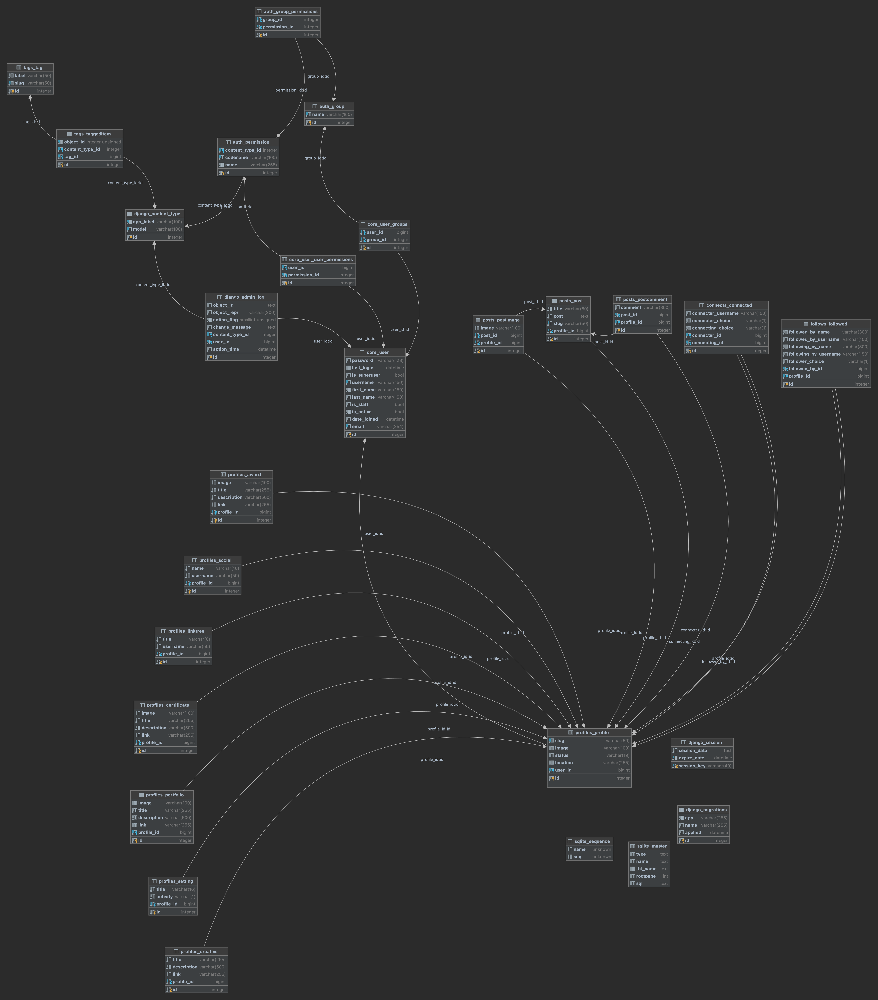

# Cotal drf API

 

## Table of Contents

- [Planes](#planes)
  - [The Surface](#surface)
  - [Skeleton](#skeleton)
  - [Structure](#structure)
  - [Scope](#scope)
  - [Strategy](#strategy)
- [Development](#development)
  - [HTML](#dev-html)
  - [CSS](#dev-css)
  - [Python](#dev-python)
  - [Testings](#testings)
  - [Bugs](#bugs)
- [Validator](#validator)
- [Deployment](#deployment)
  - [Fork](#fork)
  - [Clone](#clone)
  - [Deploy](#deploy)
- [Credits](#credits)

 

## Planes

 

### Surface

What will the product actually look like, what colors, what typography, what images/design elements, what animation, what transitions, how will the final product look like?

 

### Skeleton

(How the infomation implemented), (how will the user navigate), (how the content relate to each other, low, mid top priority, how and where to position content)?

 

### Structure

How is the information, logically grouped, the feature the elements the data?

The data model built for this project laid the foundation for how the app should work and from this point forward, all that is needed, is to get hacking.

 

 

### Scope

#### Minimum viable product

The minimum this app should include:

1. The ability to handle API HTTP errors gracefully.
2. The ability to handle API Errors gracefully.
3. The ability for admin to be able to delete user content.
4. All database models specified in frontend project.

#### Desired features

The desired features this would want:

1. API scalability effectivly.
2. API flexibility to be able to easily expand upon.
3. Email capability.

 

### Strategy

App Goal:

- Cotal-drf is the backend for Cotal aiming to fulfill and satisfy all requests about the users, posts, likes, follows, connections between users, and more.

    

Agile Development:

- Agile development methodology was used for this project, planning, developing, and delivering in small sprints. There were 2 Epic's in total spaced out over 15 days with:
  - epic 1 - 100% of the total time.
  - epic 2 - Moved to backlog.

       

   I assigned all epics labels and I prioritized all sprints according to their labeling.

      -  must-have.
      -  should have.
      -  could have.
      -  nice to have.

    

The Kanban board used was created using Github projects and can be seen [here](https://github.com/users/MTraveller/projects/3)

## Development

#### Languages Used

- [Python](https://en.wikipedia.org/wiki/Python_(programming_language) "Wikipedia's Python page")

 

### Frameworks, Libraries & Programs Used

 

1. [Git](https://git-scm.com/ "git-scm.com")
- Git was used for version control by utilizing the VSCode terminal to commit to Git and Push to GitHub.
2. [GitHub](https://github.com/ "github.com")
- GitHub is used to store the project's code after being pushed from Git.
3. [Django](https://en.wikipedia.org/wiki/Django_(web_framework) "wikipedia.com")
- Django is a high-level Python web framework that encourages rapid development and clean, pragmatic design.
4. [Django DRF](https://www.django-rest-framework.org/ "django-rest-framework.org")
- Django REST framework is a powerful and flexible toolkit for building Web APIs.
5. [Cloudinary](https://cloudinary.com/ "cloudinary.com")
- Image & Video API Trusted by 1.3M+ Developers. Cut the complexity involved in optimizing, editing, and managing media for your app, e-commerce store, marketplace, or website.
6. [Pillow](https://pypi.org/project/Pillow/ "pypi.org/project/Pillow/")
- The Python Imaging Library adds image processing capabilities to your Python interpreter.
7. [DJ Database URL](https://pypi.org/project/django-database-url/ "pypi.org/project/django-database-url/")
- This simple Django utility allows you to utilize the 12factor-inspired DATABASE_URL environment variable to configure your Django application.
8. [Django Debug Toolbar](https://pypi.org/project/django-debug-toolbar/ "pypi.org/project/django-debug-toolbar/")
- This simple Django utility allows you to utilize the 12factor-inspired DATABASE_URL environment variable to configure your Django application.
9. [djoser](https://djoser.readthedocs.io/en/latest/ "djoser.readthedocs.io/")
- REST implementation of Django authentication system. djoser library provides a set of Django Rest Framework views to handle basic actions such as registration, login, logout, password reset and account activation. It works with custom user model.
10. [DRF nested routers](https://github.com/alanjds/drf-nested-routers "github.com/alanjds/drf-nested-routers")
- This package provides routers and fields to create nested resources in the Django Rest Framework.
11. [Mockup - Sketch UI & UX](https://apps.apple.com/us/app/mockup-sketch-ui-ux/id1527554407 "apps.apple.com")
- A simple but powerful UI & UX sketching app for iPad.
12. [DataGrip](https://www.jetbrains.com/datagrip/ "jetbrains.com/datagrip")
- DataGrip is a database IDE tailored to suit professional SQL developers' specific needs.
13. [VScode](https://code.visualstudio.com "code.visualstudio.com")
- Visual Studio Code is a code editor redefined and optimized for building and debugging modern web and cloud applications. Visual Studio Code is free and available on your favorite platform - Linux, macOS, and Windows.
14. [pipenv](https://pipenv.pypa.io/en/latest/ "pipenv.pypa.io/en/latest/")
-  Pipenv is a tool that aims to bring the best of all packaging worlds (bundler, composer, npm, cargo, yarn, etc.) to the Python world. Windows is a first-class citizen, in our world.

-  It automatically creates and manages a virtualenv for your projects, as well as adds/removes packages from your Pipfile as you install/uninstall packages. It also generates the ever-important Pipfile.lock, which is used to produce deterministic builds.

    

### Dev Django and DRF

 

 

## Testings

[Testings.md]()

### Bugs

I have grown fond of eliminating bugs found in my code as I intentionally try to provoke and find them.
Currently no bugs or errors exists.

 

 

## Validator

### Validate Python

Python code were checked against PEP8 VSCode extension, and errors/warnings was fixed during development.

 

## Deployment

 

### Fork

How to fork this repository:

1. Log in to GitHub and navigate to [this repository](https://github.com/MTraveller/cotal-drf.git).
2. You'll see a button called <b>Fork</b> on the top right side of the page. Click the button to create a copy of this repository to your own GitHub account.

 

### Clone

How to clone this project:

1. Under the repository’s name, click on the Code button.
2. In the HTTPS tap, click on the clipboard icon to copy the given URL.
3. In your IDE of choice, open git bash.
4. Change the current working directory to where you want the cloned directory to be.
5. Type git clone, paste the URL copied from GitHub - hhttps://github.com/MTraveller/cotal-drf.git.
6. Press enter, and you are done.

 

### Deploy

#### Development and Production

This project was chosen to be hosted on render.com, if you choose to host else where please consult the docs of that host. Choosing to host on render then follow the steps below.
 

First create a folder anywhere you want to work with this repo. Inside this folder, follow the steps below.

Assuming you have a Github account, if not, sign-up for an Github account and continue with the below steps.
If you do not have an terminal app you can see which option there is for your operation system.

We will be using a terminal window to continue with the steps below.
I use: [Hyper](https://hyper.is "hyper.is")

`Do:` means to input the command `highlighted` into the terminal followed by "Enter" on the keyboard.
   
   1. Do: `git clone https://github.com/MTraveller/cotal-drf.git` "Press Enter"
   2. cd into cloned folder `cotal-drf`.
      -  Find the folder: 
         -  on linux: Do: `find . -name "cotal-drf" -type d` "Press Enter"
         -  on windows Do: `dir "cotal-drf" /AD /s` "Press Enter"
            -  in root - e.g. C:/
            -  [read more here](https://superuser.com/questions/428088/find-a-directory-folder-with-cmd-without-knowing-full-path "superuser.com/questions/428088/find-a-directory-folder-with-cmd-without-knowing-full-path")
   3. install [GitHub cli](https://cli.github.com "cli.github.com") if you don't have it.
      -  Do: `gh auth login` "Press Enter"
         -  follow the instructions to connect the Github CLI to your Github account.
   4. Do: `gh repo create` "Press Enter"
      - Choose:
         - Create a new repository from scratch
         - No license
         - No readme
         - Do not clone
         - Make public
          

      -  Continue the below assuming you are inside the working folder.
         1. Do: `rm -rf .git` "Press Enter"
         2. Do: `git init` "Press Enter"
         3. Do: `git remote add origin https://github.com/<your-user-name>/<created-repo-name>.git` "Press Enter"
            -  The repo you just created!
         4. Do: `git add .` "Press Enter"
         5. Do: `git commit -m "Initial commit"` "Press Enter"
         6. Do: `git branch -M main` "Press Enter"
         7. Do: `git push -u origin main` "Press Enter"
         8. Wait until files are uploaded, usually takes a couple seconds.
         9. Now this project is in your created repo.
            -  to push to GitHub you must use this command else to use git push.
            -  Do: `git branch --set-upstream-to=origin/main main` "Press Enter"

       
   1. Development:
      1. Find and rename `cotal_drf_api/settings/dev_file_rename_to_just_dev.py` to dev.py
         -  dev.py is automatically ignored by git
         -  add a Django secret key from the provided website
         -  add your cloudinary api `cloudinary://my_key:my_secret@my_cloud_name`.
      2. Open the terminal or a new one and cd to the cloned project folder.
         -  I recommend to continue with an virtual environment for more see:
            -  [pipenv](https://pipenv.pypa.io/en/latest/ "pipenv.pypa.io/en/latest/")
            -  just remember to set vscode python interpeter to the virtual environment used if vscode is used. For other programs you'll have to see their docs.
      3. Do: `python` or `python3 install -r requirements.txt` "Press Enter"
      4. Do: `python` or `python3 runserver 127.0.0.1:3000` "Press Enter"
      5. You should now be able to open the project on 127.0.0.1:3000
       
   2. Production:
      1. Sign-in or signup for a [Render.com](https://render.com "render.com") account.
      2. Open `config/.env` file copy all variables and change accordingly in a new text document "keep it open".
      3. Go to [New Env Group](https://dashboard.render.com/new/env-group "dashboard.render.com/new/env-group") and create a new environment group for this project.
      4. Scroll down to "Secret Files" press "Add Secret":
         -  in key input add:
            - .env
         -  press the eye and add:
            - all variables from the open text document you made in step 2
         -  press save.
      5. Open `render.yaml` and make any changes to reflect your project, fromGroup(from step 3) names, region etc.
         - find available [regions here](https://render.com/docs/regions "render.com/docs/regions")
      6. In the same terminal window, or open a new one if closed and cd to project folder.
      7. Do: `git add .` "Press Enter"
      8. Do: `git commit -m "Your Message"` "Press Enter"
      9. Do: `git push -u origin main` or `git push` if upstream is set "Press Enter"
      10. Go to [render to add a new blueprint](https://dashboard.render.com/select-repo?type=blueprint "dashboard.render.com/select-repo?type=blueprint")
      11. Connect your github account and give render access to the repo.
      12. Connect repo and choose service name and press apply.
      13. The project should be live in a couple minutes.
      14. Press on "Dashboard" in the navigation bar to see the creation process.

 

## Credits

 

### Sources Used

[Python Docs](https://docs.python.org/3.10/ "docs.python.org")

[Django REST framework Docs](https://www.django-rest-framework.org/ "django-rest-framework.org")

[DRF nested routers](https://github.com/alanjds/drf-nested-routers "github/alan/drf-nested-routers")

[djoser](https://djoser.readthedocs.io/en/latest/ "djoser.readthedocs.io/")

[Cloudinary](https://cloudinary.com/documentation "cloudinary.com/documentation")

[Render Docs](https://render.com/docs/blueprint-spec "render.com/docs")

 

## Acknowledgement

No code within this project is a copy unless specified explicitly in the source code. The sources used above provided guidance throughout the development.

This project is part of the "Full Stack Software Developer Diploma" at [Code Institute](https://codeinstitute.net/).

MT 2022.

[Back to top](#the-5th-project-portfolio-of-ci)
