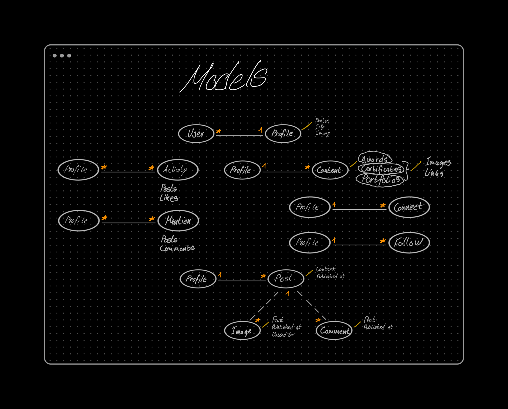

# Cotal drf API

 

## Table of Contents

- [Planes](#planes)
  - [The Surface](#surface)
  - [Skeleton](#skeleton)
  - [Structure](#structure)
  - [Scope](#scope)
  - [Strategy](#strategy)
- [Development](#development)
  - [HTML](#dev-html)
  - [CSS](#dev-css)
  - [Python](#dev-python)
  - [Testings](#testings)
  - [Bugs](#bugs)
- [Validator](#validator)
- [Deployment](#deployment)
  - [Fork](#fork)
  - [Clone](#clone)
  - [Deploy](#deploy)
- [Credits](#credits)

 

## Planes

 

### Surface

What will the product actually look like, what colors, what typography, what images/design elements, what animation, what transitions, how will the final product look like?

 

### Skeleton

(How the infomation implemented), (how will the user navigate), (how the content relate to each other, low, mid top priority, how and where to position content)?

 

### Structure

How is the information, logically grouped, the feature the elements the data?

The data model built for this project laid the foundation for how the app should work and from this point forward, all that is needed, is to get hacking.

 

 

### Scope

#### Minimum viable product

The minimum this app should include:

1. The ability to handle API HTTP errors gracefully.
2. The ability to handle API Errors gracefully.
3. The ability for admin to be able to delete user content.
4. All database models specified in frontend project.

#### Desired features

The desired features this would want:

1. API scalability effectivly.
2. API flexibility to be able to easily expand upon.
3. Email capability.

 

### Strategy

App Goal:

- Cotal-drf is the backend for Cotal aiming to fulfill and satisfy all requests about the users, posts, likes, follows, connections between users, and more.

    

Agile Development:

- Agile development methodology was used for this project, planning, developing, and delivering in small sprints. There were 2 Epic's in total spaced out over 15 days with:
  - epic 1 - 100% of the total time.
  - epic 2 - Moved to backlog.

       

   I assigned all epics labels and I prioritized all sprints according to their labeling.

      -  must-have.
      -  should have.
      -  could have.
      -  nice to have.

    

The Kanban board used was created using Github projects and can be seen [here](https://github.com/users/MTraveller/projects/3)

## Development

#### Languages Used

- [Python](https://en.wikipedia.org/wiki/Python_(programming_language) "Wikipedia's Python page")

 

### Frameworks, Libraries & Programs Used

 

1. [Git:](https://git-scm.com/ "git-scm.com")
   - Git was used for version control by utilizing the VSCode terminal to commit to Git and Push to GitHub.
2. [GitHub:](https://github.com/ "github.com")
   - GitHub is used to store the project's code after being pushed from Git.
3. [Django](https://en.wikipedia.org/wiki/Django_(web_framework) "wikipedia.com")
   - Django is a high-level Python web framework that encourages rapid development and clean, pragmatic design.
4. [Django DRF](https://www.django-rest-framework.org/ "django-rest-framework.org")
   - Django REST framework is a powerful and flexible toolkit for building Web APIs.
5. [Cloudinary](https://cloudinary.com/ "cloudinary.com")
   - Image & Video API Trusted by 1.3M+ Developers. Cut the complexity involved in optimizing, editing, and managing media for your app, e-commerce store, marketplace, or website.
6. [Pillow](https://pypi.org/project/Pillow/ "pypi.org/project/Pillow/")
   - The Python Imaging Library adds image processing capabilities to your Python interpreter.
7. [DJ Database URL](https://pypi.org/project/django-database-url/ "pypi.org/project/django-database-url/")
   - This simple Django utility allows you to utilize the 12factor-inspired DATABASE_URL environment variable to configure your Django application.
8. [Django Debug Toolbar](https://pypi.org/project/django-debug-toolbar/ "pypi.org/project/django-debug-toolbar/")
   - This simple Django utility allows you to utilize the 12factor-inspired DATABASE_URL environment variable to configure your Django application.
9. [djoser](https://djoser.readthedocs.io/en/latest/ "djoser.readthedocs.io/")
   - REST implementation of Django authentication system. djoser library provides a set of Django Rest Framework views to handle basic actions such as registration, login, logout, password reset and account activation. It works with custom user model.
10. [DRF nested routers](https://github.com/alanjds/drf-nested-routers "github.com/alanjds/drf-nested-routers")
   - This package provides routers and fields to create nested resources in the Django Rest Framework.
11. [Mockup - Sketch UI & UX](https://apps.apple.com/us/app/mockup-sketch-ui-ux/id1527554407 "apps.apple.com")
   - A simple but powerful UI & UX sketching app for iPad.
12. [DataGrip](https://www.jetbrains.com/datagrip/ "jetbrains.com/datagrip")
   - DataGrip is a database IDE tailored to suit professional SQL developers' specific needs.
13. [VScode](https://code.visualstudio.com "code.visualstudio.com")
   - Visual Studio Code is a code editor redefined and optimized for building and debugging modern web and cloud applications. Visual Studio Code is free and available on your favorite platform - Linux, macOS, and Windows.
00. 
   - 

    

### Dev Django and DRF

 

 

## Testings

[Testings.md]()

### Bugs

I have grown fond of eliminating bugs found in my code as I intentionally try to provoke and find them.
Currently no bugs or errors exists.

 

 

## Validator

### Validate Python

Python code were checked against PEP8 VSCode extension, and errors/warnings was fixed during development.

 

## Deployment

 

### Fork

How to fork this repository:

1. Log in to GitHub and navigate to [this repository](https://github.com/MTraveller/cotal-drf.git).
2. You'll see a button called <b>Fork</b> on the top right side of the page. Click the button to create a copy of this repository to your own GitHub account.

 

### Clone

How to clone this project:

1. Under the repository’s name, click on the Code button.
2. In the HTTPS tap, click on the clipboard icon to copy the given URL.
3. In your IDE of choice, open git bash.
4. Change the current working directory to where you want the cloned directory to be.
5. Type git clone, paste the URL copied from GitHub - hhttps://github.com/MTraveller/cotal-drf.git.
6. Press enter, and you are done.

 

### Deploy

1. #### Development and Production

-  This project was chosen to be hosted on render.com, if you choose to host else where please consult the docs of that host. Choosing to host on render then follow the steps below.
    

   First create a folder anywhere you want to work with this repo. Inside this folder, follow the steps below.

   1. In a terminal window do: `git clone https://github.com/MTraveller/cotal-drf.git`
   2. cd into folder
   3. install [GitHub cli](https://cli.github.com "cli.github.com") if you don't have it.
   4. Do: `gh repo create` - follow instruction "Choose: No license, no readme - just create an  empty repo".
       
      1. Choose not to clone locally then continue the below assuming you are inside the working folder.
      <!-- Step 3 - the repo you just created! -->
      2. Do: `git remote add origin https://github.com/<user>/<repo>.git`
         1. if you get an fatal: error.
         2. Do: `rm -rf .git`
         3. Do: `git init` and `git remote add origin https://github.com/<user>/<repo>.git`
         4. Do: `git add .` and `git commit -m "Initial commit"`
      3. Do: `git branch -M main`
      4. Do: `git push -u origin main`
      5. Wait until files are uploaded, can take some time.
      6. Now this project is in your created repo.
       
   1. Development:
      <!-- dev.py is automatically ignored by git -->
      1. Find and rename `cotal_drf_api/settings/dev_file_rename_to_just_dev.py` to dev.py
      2. Add a Django secret key from the provided website and add your cloudinary api `cloudinary://my_key:my_secret@my_cloud_name`.
      3. Open the terminal or a new one and cd to the cloned project folder.
      3. Do: `python` or `python3 install -r requirements.txt`
      4. Do: `python` or `python3 runserver 127.0.0.1:3000`
      5. You should now be able to open project on 127.0.0.1:3000
       
   2. Production:
      1. Sign-in or signup for a [Render.com](https://render.com "render.com") account.
      2. Open `config/.env` file copy all variables and change accordingly in a new text document "keep it open".
      3. Open `render.yaml` and make any changes to reflect your project, like names, location etc.
      4. Go to Render.com and go to [New Env Group](https://dashboard.render.com/new/env-group "dashboard.render.com/new/env-group")
      5. Create a new environment group for this project.
      6. Scroll down to "Secret Files" press "Add Secret" in key add: .env then press the eye and add all variables from the open text document you made in step 2 and save.
      7. In the same terminal window, or open a new one if closed and cd to project folder.
      8. Do: `git add .`
      9. Do: `git commit -m "Your Message"`
      10. Do: `git push -u origin main`
      11. Go to [render to add new blueprint](https://dashboard.render.com/select-repo?type=blueprint "dashboard.render.com/select-repo?type=blueprint")
      12. Connect your github account and give render access to the repo.
      13. Connect repo and choose service name and press apply.
      14. The project should be live in a couple minutes.
      15. Press on "Dashboard" in the navigation bar to see the creation process.

 

## Credits

 

### Sources Used

[Python Docs](https://docs.python.org/3.10/ "docs.python.org")

[Django REST framework Docs](https://www.django-rest-framework.org/ "django-rest-framework.org")

[DRF nested routers](https://github.com/alanjds/drf-nested-routers "github/alan/drf-nested-routers")

[djoser](https://djoser.readthedocs.io/en/latest/ "djoser.readthedocs.io/")

[Cloudinary](https://cloudinary.com/documentation "cloudinary.com/documentation")

[Render Docs](https://render.com/docs/blueprint-spec "render.com/docs")

 

## Acknowledgement

No code within this project is a copy unless specified explicitly in the source code. The sources used above provided guidance throughout the development.

This project is part of the "Full Stack Software Developer Diploma" at [Code Institute](https://codeinstitute.net/).

MT 2022.

[Back to top](#the-5th-project-portfolio-of-ci)
