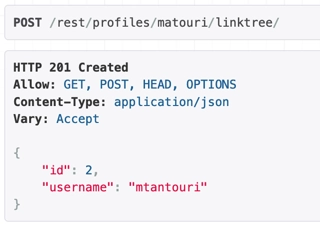
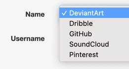
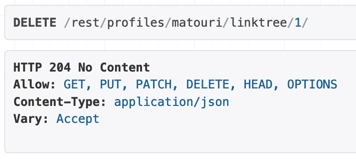
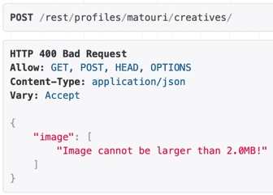
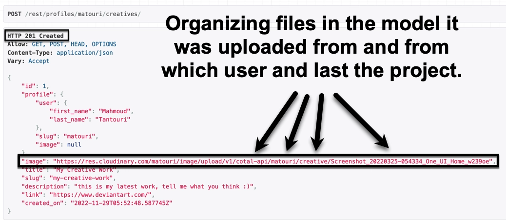
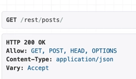
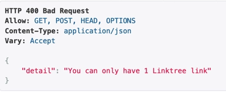

## Testings

This project has gone through extensive testing continuously during development, and every bug has been squashed to the best of my limited time and ability.

From the very beginning of the project, structure and security have been top priorities, and do_permissions.py is the result of that. It was not possible without extensive testing.

For every model, POST and PUT have been tested throughout the development process, and results are as expected.

The social model options have been tested and work as expected.

The deletion of objects worked as expected. Only the object's owner has the ability to update and/or delete it.

Validation and file size

The maximum file size set for this project is 2 MB, and the user will get a notification if the image is over that.

Organizing files and users helps with better cleaning and ensures the app runs optimally.

GET-only endpoints are in place for both logged-in and not-authenticated users to ensure every user is where they should be.

Rules and limitations are set for optimal results.

Slug-based lookups were tested throughout the models, which worked as expected.

